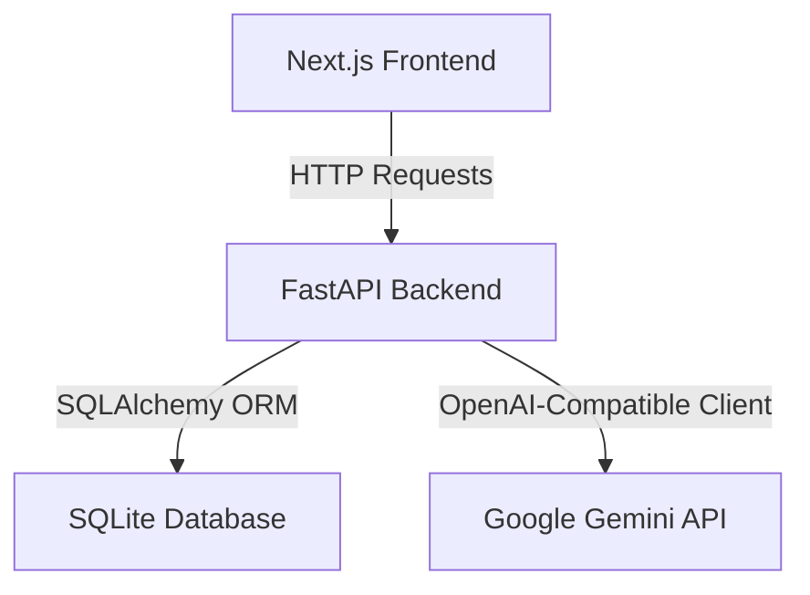
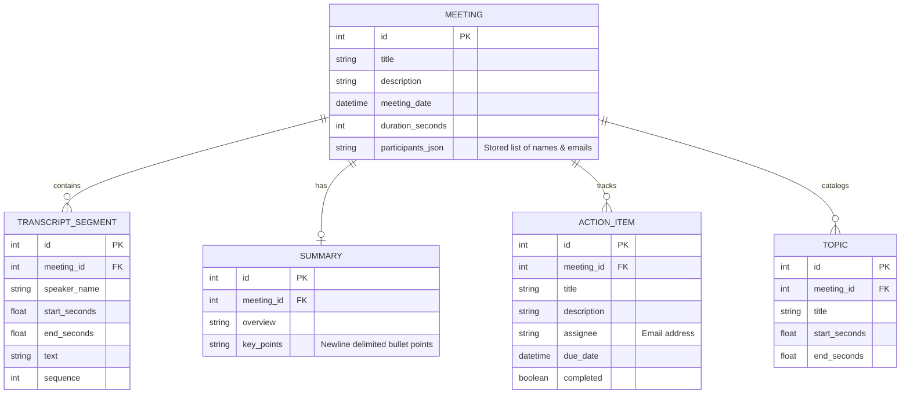

# Firefiles Meeting Analysis Platform

An LLM-powered meeting analysis and transcription review platform built using Next.js, FastAPI, SQLite, and Google Gemini.

## Table of Contents
1. [Project Description](#project-description)
2. [Tech Stack](#tech-stack)
3. [Architecture Overview](#architecture-overview)
4. [Database Schema](#database-schema)
5. [API Overview](#api-overview)
6. [Local Setup](#local-setup)
   - [Backend Setup](#backend-setup)
   - [Frontend Setup](#frontend-setup)
7. [LLM & Gemini Configuration](#llm--gemini-configuration)
8. [Assumptions](#assumptions)
9. [Deployment Readiness](#deployment-readiness)

---

## Project Description

This platform enables users to import meetings, view interactive chronological transcripts, search and highlight text within transcripts, play synced meeting audio, edit details, and run/regenerate AI-powered meeting analyses (Summary, Key Points, Action Items, and Chapter Topics) using Google's Gemini LLMs.

---

## Tech Stack

*   **Frontend**: Next.js 15 (React 19), Tailwind CSS, Lucide icons, TypeScript.
*   **Backend**: FastAPI, SQLAlchemy ORM, Uvicorn, SQLite.
*   **AI Integration**: Google Gemini OpenAI-compatible API (`gemini-3.5-flash`).

---

## Architecture Overview



1.  **Frontend**: Single-Page App (SPA) dashboard containing:
    *   **Dashboard**: Search, filter by participant email/date, sort by recency, and create meetings with metadata & pasted transcript turns.
    *   **Meeting Detail**: Chronological scroll-to-view transcripts, dynamic audio playback synchronization, action item management (CRUD), and AI summary trigger controls.
2.  **Backend**: REST API using FastAPI.
3.  **Database**: Local SQLite database storing relational data.

---

## Database Schema



---

## API Overview

### Meetings CRUD
*   `GET /api/meetings`: Fetch meeting list with title query, participant email, date filters, and sorting.
*   `POST /api/meetings`: Create a new meeting.
*   `GET /api/meetings/{id}`: Fetch detailed meeting data.
*   `PATCH /api/meetings/{id}`: Update meeting metadata.
*   `DELETE /api/meetings/{id}`: Cascade delete a meeting and all its related segments/analysis records.

### AI Analysis
*   `POST /api/meetings/{id}/generate-summary`: Run Gemini model analysis on the chronological transcript and save the generated Summary, Action Items, and Chapter Topics.
*   `POST /api/meetings/{id}/regenerate-summary`: Re-run analysis and replace existing data without duplication.

### Action Items CRUD
*   `POST /api/action-items`: Add a manual action item.
*   `PATCH /api/action-items/{id}`: Edit action item title, description, assignee, due date, or toggle completion.
*   `DELETE /api/action-items/{id}`: Delete an action item.

---

## Local Setup

### Backend Setup

1.  Navigate to the backend directory:
    ```bash
    cd backend
    ```
2.  Create and activate virtual environment:
    ```bash
    python -m venv venv
    source venv/bin/activate
    ```
3.  Install dependencies:
    ```bash
    pip install -r requirements.txt
    ```
4.  Configure environment variables in `.env`:
    ```env
    DATABASE_URL=sqlite:///./meetings.db
    GEMINI_API_KEY=your_gemini_api_key_here
    LLM_PROVIDER=gemini
    OPENAI_MODEL=gemini-3.5-flash
    ```
5.  Seed the SQLite database:
    ```bash
    python seed.py
    ```
6.  Start FastAPI:
    ```bash
    python -m uvicorn app.main:app --port 8000 --reload
    ```

### Frontend Setup

1.  Navigate to the frontend directory:
    ```bash
    cd frontend
    ```
2.  Install packages:
    ```bash
    npm install
    ```
3.  Configure environment variables in `.env.local`:
    ```env
    NEXT_PUBLIC_API_URL=http://localhost:8000
    ```
4.  Run development server:
    ```bash
    npm run dev
    ```
5.  Access in browser at `http://localhost:3000`.

---

## LLM & Gemini Configuration

The platform leverages Google Gemini's OpenAI-compatible base URL:
*   **Base URL**: `https://generativelanguage.googleapis.com/v1beta/openai/`
*   **Model**: `gemini-3.5-flash`
*   **Key**: Configured securely via the backend `GEMINI_API_KEY` env variable. Keys are never exposed to the frontend browser context.

---

## Assumptions

1.  **Audio Availability**: Since real meetings do not always have pre-uploaded audio files, the system employs a hybrid player. If the sample audio fails to load, it falls back to simulated playback so users can test seeking and transcription highlights seamlessly.
2.  **Transcript Format**: Custom meeting creation parses transcript text lines in the format `Speaker: Text`. Unlabeled lines default to `Organizer`.

---

## Deployment Readiness

1.  **CORS Settings**: Backend CORS is configured dynamically to allow specified origins. Update `allow_origins` in `app/main.py` for staging/production domains.
2.  **Port binding**: Frontend builds export statically or run in SSR. Use `NEXT_PUBLIC_API_URL` pointing to the public domain of the FastAPI instance.
3.  **Security**: Keep `GEMINI_API_KEY` in secure server-side vaults (e.g. Vercel Env, Google Secrets Manager). Never commit `.env` or `.env.local` to public repositories.
